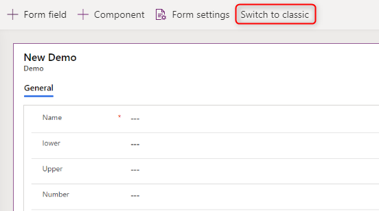
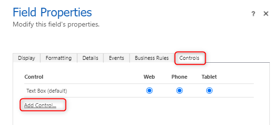
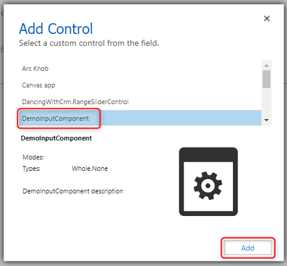
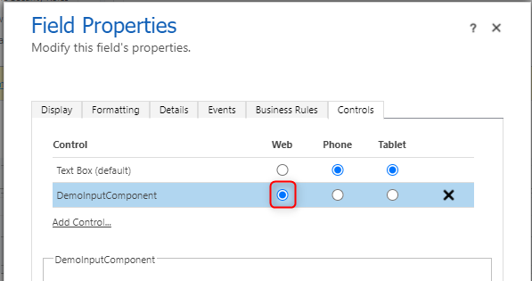

# 2. Create first PCF
In this chapter we will create our first PCF.

## Goals
- Setup first PCF
- Add basic HTML to it
- Add the PCF to Dataverse

## Todo's
In this section I will describe the tasks you have to execute to reach the goals of this chapter.

### Initialize PCF project
To init the PCF project we have to execute the following commands in the Terminal within VS Code.

1. `pac pcf init --namespace DemoInputComponent --name DemoInputComponent --template field`

This command will initialize a pcf of the type "field". It will have the name and Namespace "DemoInputComponent".
It should have created a new folder called "DemoInputComponent" in the current folder. This will basically be our working folder, even though the terminal always has to be on the folder you created in the first part. This folder (you created manually) should include all the config for PCF, TypeScript and npm (tsconfig.json, package.json, pcfconfig.json, ...).

2. `npm install`

This command will install all the needed npm packages. It takes some minutes to execute. After it is finsihed you should have a "node_modules" folder._

### Update files
We have to update a few files within our working directory, DemoInputComponent, to add the basic HTML.

#### ControlManifest.Input.xml
The Manifest desfines all the Inputs, Outputs and components (css, images, ...) of our component. It includes a lot of useful comments.

In our case we have to change the following stuff in the only active "property" (should be line 21).
- name to "input"
- of-type to "Whole.None"

On the [MS docs](https://docs.microsoft.com/en-us/powerapps/developer/component-framework/manifest-schema-reference/property#remarks) you can read more about the different types that are possible as well as not currently supported (like LookUp).

#### index.ts
The second file we have to change is the index.ts. This file will include all our "logic".
As the first thing within the class we have to define a new variable which will be our HTML element to display the value.
`private _element: HTMLSpanElement;`

The index.ts file includes basically 4 functions
- init - should contain all the code to initialize the component. Stuff that only has to be done once.
- updateView - Will be called whenever one of the properties (defined in the manifest) is changed.
- getOutputs - Called by the framework to get the value
- destroy - Gets called when the component is destroyed to clean up.

We have to change the first 2 functions.

##### init function
Here we will
- create a new span element
- store it in the variable we created
- add the input as the innerHTML
- append it to the container

``` Typescript
this._element = document.createElement("span");
this._element.innerHTML = context.parameters.input.raw ? context.parameters.input.raw.toString() : "";
container.appendChild(this._element);
```

##### updateView function
Whenever the input is changed we have to update the innerHtml of our element.

``` Typescript
this._element.innerHTML = context.parameters.input.raw ? context.parameters.input.raw.toString() : "";
```

VS Code will show errors on that since the parameter "input" aren't in the type decleration yet. This will automatically fixed when we build the project the next time.


## Build and deploy
In this section we will build and deploy our pcf the first time.

To build it we simply run `npm run build` in the terminal.

To deploy we execute `pac pcf push -pp <prefix>` in the terminal. Here you have to replace "\<prefix>" with your prefix. I usually have "bebe" for example.
The CLI will use the connection that is marked with a * when you run `pac auth list`.

## Add to Dataverse
If you login to your environemnt you should see a solution, called "PowerAppsTools_\<prefix>", which contains your PCF.

To be able to add a custom component we, unfortunatetly, have to switch to the classic editor of an form.



Here we add the field called "Number" a second time.
When dubbel clicking on that a new pop up opens, in there you have to choose "Controls" and then "Add Control".



In the second pop up you select your PCF from the list and press "Add".



It is important to select for which device it should be shown. In our case "Web".



Save and publish everything and enjoy your first PCF.

## Conclusion

With only a few steps it is possible to create a very simple PCF. We also learned how to add a PCF to Dataverse.
