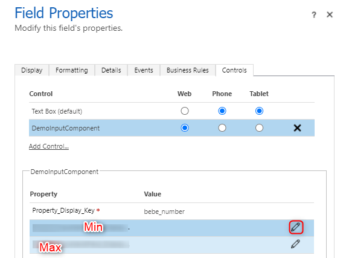
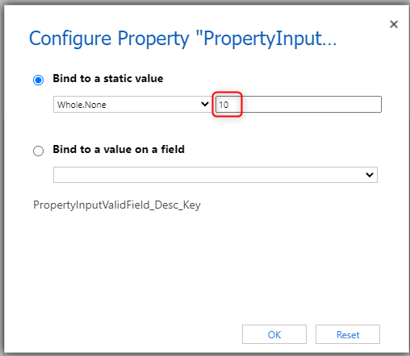

# 5. Add Configuration
In this chapter we will learn how to make it possible to configure the min and max values of the PCF.
With that one coule use the same PCF several times with different ranges.

## Goals
- Add configuration to PCF

## Todo's
In this section I will describe the tasks you have to execute to reach the goals of this chapter.

### Change files
To add the desired configuration is actually quite simple. We have to change two files.

#### ControlManifest.Input.xml
We add two new properties to the manifest they will
- have the names min & max
- be of-type "Whole.None"
- have usage "input"
- have required "false"

``` XML
<property name="min" display-name-key="Min" description-key="PropertyInputValidField_Desc_Key" of-type="Whole.None" usage="input" required="false" />
<property name="max" display-name-key="Max" description-key="PropertyInputValidField_Desc_Key" of-type="Whole.None" usage="input" required="false" />
```

#### index.ts
Here we only have to change the init function

##### init function
At the end of the function we would like to
- fetch the value of our properties
- set the value as the value of our variables
- if the value isn't present we set a default as the value of our variables

```Typescript
this._min = context.parameters.min.raw? context.parameters.min.raw : 0;
this._max = context.parameters.max.raw? context.parameters.max.raw : 100;
```

VS Code will show errors on that since the parameters "min" and "max" aren't in the type decleration yet. This will automatically fixed when we build the project the next time.

### Test
This time we will deploy the pcf to Dataverse (don't forgett to increase the version).
```
npm run build
pac pcf push -pp <prefix>
```

#### Config in Dataverse
To configure our PCF we open the field properties again. When you select your demo PCF you will see two new rows (Min & Max). By clicking the little pen symbol a config window will open.



In this popup you could either define a fixed value or choose a field which will provide the value, which makes it even more dynamic.



Feel free to play around with it. Try different ranges. Configure the PCF several times, maybe with different ranges.

## Conclusion
In this chapter you learned how to make it possible to configure your PCF and make it more reusable.